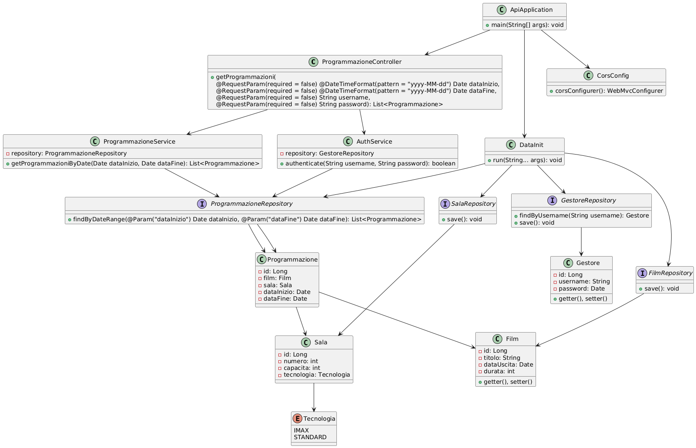
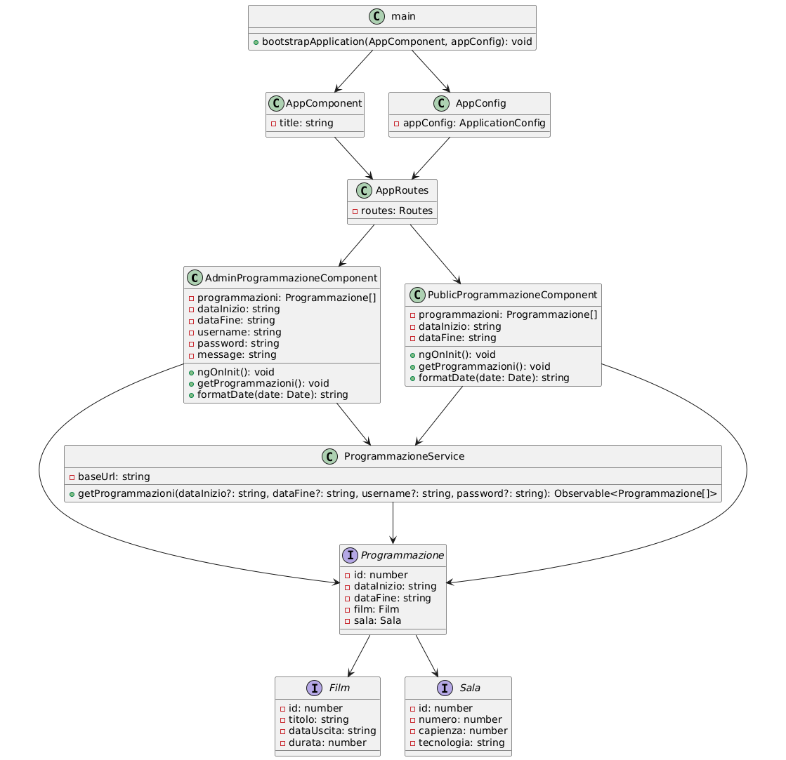

CineMille - Sistema di Gestione Programmazione Cinema
========================================================

Questo progetto è una **applicazione fullstack** per la gestione e la visualizzazione della programmazione dei film del multisala **CineMille**.

*   Un **backend** sviluppato in **Spring Boot** (Java) per esporre un'API REST.
*   Un **frontend** sviluppato in **Angular** per consentire la visualizzazione dei film (sia lato pubblico che amministrativo).

Come eseguire il progetto
----------------------------

### 1. Avvio del Backend (Spring Boot)

#### Requisiti:

*   Java 21+
*   Maven 3+

#### Passaggi:

    git clone https://github.com/fala-flash/cinemille.git
    cd cinemille/api/api

    mvn spring-boot:run

Il backend sarà disponibile all'indirizzo: `http://localhost:8080`

### 2. Avvio del Frontend (Angular)

#### Requisiti:

*   Node.js 22.14+
*   Angular CLI 19.1.8+

#### Passaggi:

    cd ../../client

    npm install

    npm start

Il frontend sarà disponibile all'indirizzo: `http://localhost:4200`

Funzionalità disponibili
---------------------------

### Vista pubblica (Non autenticata)

*   Visualizzazione dei film **attualmente in programmazione**.
*   Filtro per data di inizio e data di fine (impostate di default dalla data odierna a 3 settimane dopo).

### Vista Admin (Autenticata)

*   Accesso tramite **username** e **password**.
*   Visualizzazione di tutte le programmazioni, incluse quelle passate.
*   Filtro per data di inizio e data di fine (impostate di default dalla data odierna a 3 settimane dopo).

### Credenziali di esempio (Admin)

*   **Username**: `admin`
*   **Password**: `admin123`

API disponibili (Backend REST)
---------------------------------

### Endpoint pubblici (Non autenticati)
*   **GET** `/api/programmazioni?start=YYYY-MM-DD&end=YYYY-MM-DD`  
    Restituisce tutte le programmazioni **attive** nel periodo specificato.

### Endpoint autenticati (Admin)
*   **GET** `/api/programmazioni?start=YYYY-MM-DD&end=YYYY-MM-DD&username=<username>&password=<password>`  
    Restituisce tutte le programmazioni nel periodo specificato, **comprese quelle passate**.

Tecnologie utilizzate
-------------------------

*   **Backend:** Java 21, Spring Boot 3.4.3, Spring Web, Spring Data JPA, H2 Database
*   **Frontend:** Angular 19, TypeScript, HTML5, CSS3
*   **Build Tools:** Maven, Node.js

### Class Diagram API (Spring Boot)

Il seguente diagramma rappresenta la struttura delle classi  utilizzate nel backend realizzato con Spring Boot. Mostra le relazioni tra i controller, i servizi, i repository e le entità.

### Class Diagram Client (Angular)

Il seguente diagramma rappresenta la struttura delle classi  utilizzate nel client realizzato con Angular. Mostra le relazioni tra i componenti i servizi e le interfacce.

